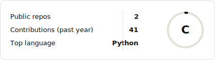

# Pedro

Small, sharp primitives that do one thing well.

 

<picture>
  <source media="(prefers-color-scheme: dark)" srcset="./stats-dark.svg">
  
</picture>

  

<strong>STACK</strong>

 

<picture>
  <source media="(prefers-color-scheme: dark)" srcset="./stack-dark.svg">
  
</picture>

  

<strong>PRINCIPLES</strong>

 

<picture>
  <source media="(prefers-color-scheme: dark)" srcset="./principles-dark.svg">
  
</picture>

  

<a href="https://x.com/pedroeclemente">
  <picture>
    <source media="(prefers-color-scheme: dark)" srcset="./x-dark.svg">
    
  </picture>
</a>

